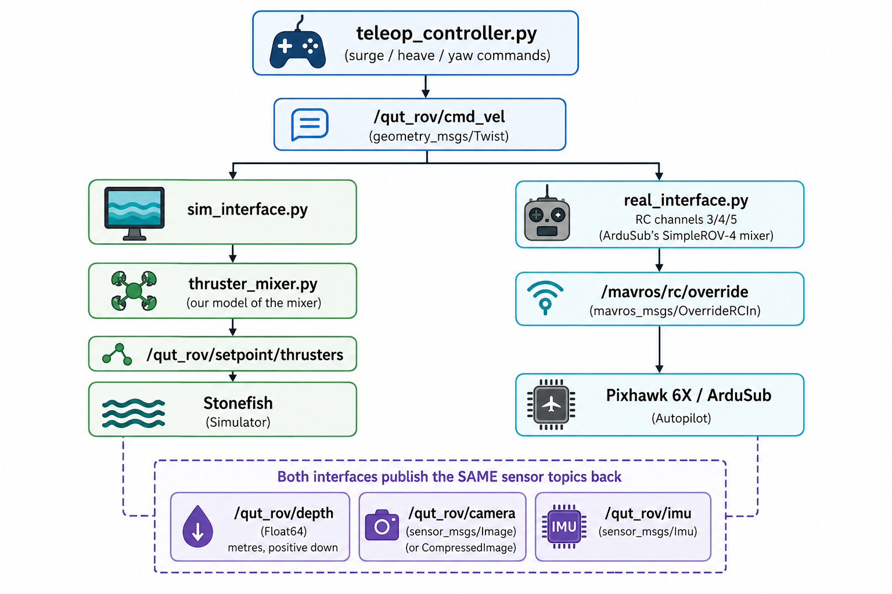
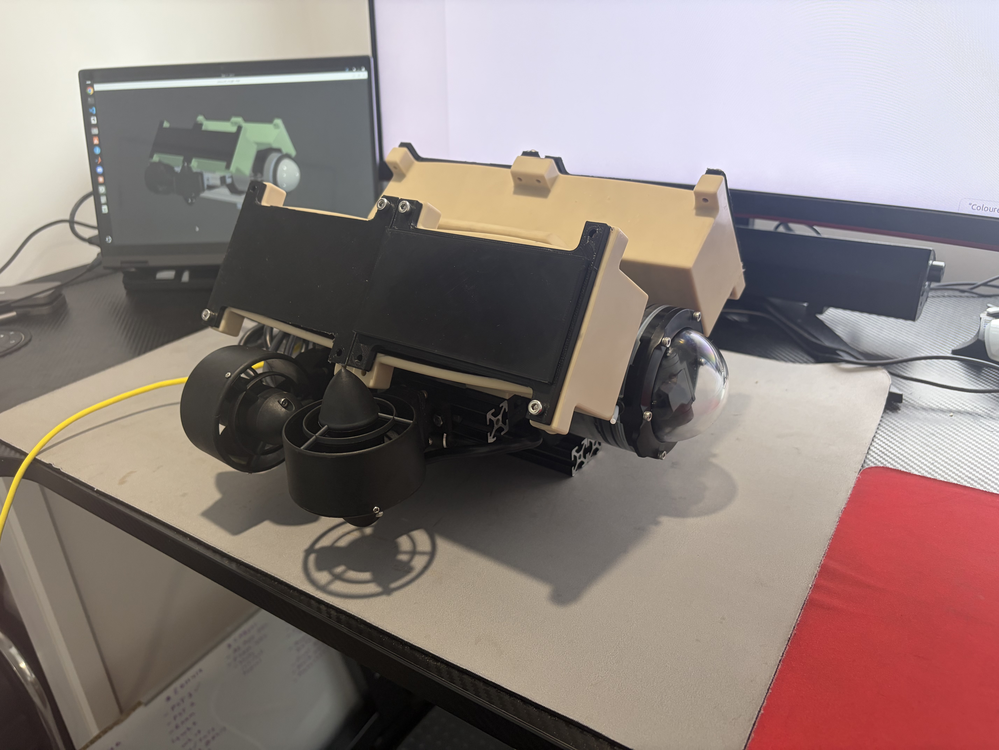

# SubbyROV — Digital Twin to Real Vehicle Control Stack

This ROS 2 control stack for the QUT SubbyROV underwater vehicle was built so that
the **same controller code can drive both the Digital Twin (DT) and the real
ROV**. Only the interface layer changes between them.

This was made for the EGH490 Research Project at QUT.

---

## Architecture

Everything hinges on one abstraction: the high-level controller only ever
publishes vehicle-level commands to the ROS 2 topic `/qut_rov/cmd_vel`, and only ever reads
sensor data from `/qut_rov/depth`, `/qut_rov/camera` and `/qut_rov/imu`. 
The main teleop code is agnostic to whether it is driving a simulation or a real vehicle.

<p align="center">
  
</p>

### Digital Twin and real vehicle side by side

The real physical ROV, with the Digital Twin running live on the laptop
screen in the background:

<p align="center">
  
</p>

### Digital Twin Functions
Here is a demonstration of the Digital Twin in the simulation.
The Twin performs:
- Teleoperation
- Station Keeping
- Trajectory Setting
- Fish Detection and Tracking

All within a simulated 3D coral environment.

https://github.com/user-attachments/assets/ffbe256a-3c4d-401d-acdf-2d69c06081ee

### Nodes

| Node | Role |
|---|---|
| `rov_control.py` | Launcher. Prompts for sim or real, starts the stack, tears it down cleanly |
| `rov_launcher_gui.py` | Optional GUI wrapper around the launcher |
| `teleop_controller.py` | Gamepad input, depth hold, trajectory mode. Mode-agnostic |
| `sim_interface.py` | Translates `cmd_vel` to Stonefish thruster setpoints |
| `real_interface.py` | Translates `cmd_vel` to MAVROS RC override; bridges Bar30 and IMU |
| `thruster_mixer.py` | Surge/heave/yaw to four-thruster allocation (**sim only**) |
| `pid_controller.py` | PID with derivative-on-measurement and integral clamping |
| `imu_depth_plotter.py` | Live depth and roll/pitch/yaw plot. Works in both modes |
| `camera_viewer_rtsp.py` | RTSP viewer for the real camera (real mode) |
| `fish_detector_follower.py` | YOLO fish detection and visual servoing (**sim only**) |
| `rov_config.py` | All topics, gains, and button mappings. Sim values are canonical |
| `sim_to_real_scales.py` | Real-vehicle scalers and hardware constants — the only file you should need to edit at the pool |
| `control_utils.py` | Shared math helpers: deadzone, clamping, quaternion-to-RPY/yaw |

### Thrust allocation is not shared

`thruster_mixer.py` runs in **simulation only**, translating surge, heave, and yaw commands from a single value into an 1x4 array,
commanding each thruster to a specific value. However, on the real vehicle, the
vehicle-level commands go straight to ArduSub's RC channels and the
Pixhawk's SimpleROV-4 automatic mixer, which does the allocation.

---

## Installation

Set up in this order: a working Stonefish simulation first, then this repo,
then — only if you have the physical vehicle — MAVROS and the tether
network.

### 1. Stonefish simulation

A regular [Stonefish](https://github.com/patrykcieslak/stonefish) +
[`stonefish_ros2`](https://github.com/patrykcieslak/stonefish_ros2) setup,
nothing custom:

1. [ROS 2 Jazzy](https://docs.ros.org/en/jazzy/Installation/Ubuntu-Install-Debians.html) on Ubuntu 24.04
2. Build and install the [Stonefish](https://github.com/patrykcieslak/stonefish) library
3. Clone [`stonefish_ros2`](https://github.com/patrykcieslak/stonefish_ros2) into a colcon workspace and build it (*match versions between the two*)

Confirm it launches on its own before moving on — this repo assumes a
working Stonefish install and won't help you debug that layer.

### 2. This repo

```bash
mkdir -p ~/ros2_ws/src
cd ~/ros2_ws/src
git clone https://github.com/Brad420169/QUT_ROV_Digital_Twin stonefish_qut_rov

cd ~/ros2_ws/src/stonefish_qut_rov/ros_nodes/modular_architecture
chmod +x *.py
```

System and Python packages (needed in both sim and real mode):

```bash
sudo apt install ros-jazzy-joy ffmpeg python3-tk
pip install opencv-python matplotlib ultralytics
```

`ultralytics` is only used by `fish_detector_follower.py` (sim mode). A
GameSir-style gamepad is expected (developed against a Zikway HID) —
reconfigure `rov_config.py`'s button mappings for a different controller.

```bash
cd ~/ros2_ws
colcon build --packages-select stonefish_qut_rov
source install/setup.bash
```

**The `chmod +x` matters.** `ros2 run` silently reports *"No executable
found"* for a script without the executable bit, which looks like a missing
file rather than a permissions problem. If you add a new node/python script, add it to the
`install(PROGRAMS ...)` block in `CMakeLists.txt` and run the build commands again.

### 3. Physical vehicle (skip for simulation-only use)

MAVROS bridges this stack to the Pixhawk:

```bash
sudo apt install ros-jazzy-mavros ros-jazzy-mavros-extras
sudo /opt/ros/jazzy/lib/mavros/install_geographiclib_datasets.sh
```

**Host network setup** — not in the repo, and must be redone on every new
machine. Two subnets run over the single Fathom tether link:

| Device | Address |
|---|---|
| Your computer (ROV subnet) | `192.168.2.1` |
| Pixhawk 6X | `192.168.2.2` |
| Your computer (camera subnet) | `192.168.144.1` |
| Z-1Mini camera | `192.168.144.108` |

Find your tether interface — the name differs per machine, so don't copy
one from elsewhere:

```bash
ip -br addr
```

Then add both addresses:

```bash
sudo ip addr add 192.168.2.1/24   dev <interface>
sudo ip addr add 192.168.144.1/24 dev <interface>
```

These are lost on reboot. To make them stick:

```bash
nmcli con show
nmcli con mod "<connection>" +ipv4.addresses 192.168.144.1/24
nmcli con up "<connection>"
```

See [Vehicle setup that lives outside this repo](#vehicle-setup-that-lives-outside-this-repo)
below for ArduSub parameters and camera configuration.

---

## Running

```bash
ros2 run stonefish_qut_rov rov_control.py
```

Then choose `s` for simulation or `r` for the real vehicle. The launcher
handles startup ordering and shuts the whole stack down on Ctrl+C.

MAVROS output goes to `/tmp/mavros.log` rather than the terminal, since its
plugin banner spams the terminal during startup:

```bash
tail -f /tmp/mavros.log
```

### Controls

| Input | Action |
|---|---|
| Left stick up/down | Surge |
| Right stick left/right | Yaw |
| RT / LT | Heave up / down |
| L bumper | Depth keeping |
| R bumper | Trajectory mode |
| Y button | Camera / detector |
| X button | Fish follow (sim only) |
| D-pad up | Depth / IMU plotter |

---

## Sim-to-real transfer

Every constant in `rov_config.py` is the **simulation** value and stays
canonical — the digital twin is the reference. `sim_to_real_scales.py`
adapts those values for the real vehicle:

```python
REAL_SCALE_TRAJ_FORWARD = 0.5    # real vehicle is faster than the DT predicts
REAL_SCALE_DEPTH_KP     = 1.0    # transfers directly
```
Scalers apply in real mode only; simulation always runs unscaled. They are
resolved once at startup in `teleop_controller._resolve_scaling()`, so no
control path branches on mode. Changing one requires a restart, not just a
rebuild — the PID objects are constructed with the scaled gains.

---

## Vehicle setup that lives outside this repo

### ArduSub parameters

- Frame set to **SimpleROV-4**, so channels map as ch3 = heave,
  ch4 = yaw, ch5 = surge
- `AHRS_ORIENTATION` must match how the Pixhawk is physically mounted.
  A mismatch shows up as a large constant roll or pitch offset with the
  vehicle level, and corrupts yaw as well
- Compass calibrated **with the battery and thrusters in place**. An
  uncalibrated or rejected compass leaves yaw on gyro dead-reckoning, which
  drifts linearly and silently — heading hold will look like a slow turn

### Camera (Z-1Mini)

The pod is a small BusyBox Linux system reachable over SSH. Its config lives
at `/opt/bin/gcu/`, not in this repo — reference copies are in
`config/camera/`.

Changes made for underwater use:

| Setting | Value | Why |
|---|---|---|
| `Ai` | `false` | Shipped running a drone-surveillance YOLO model. Useless for fish, pure waste heat |
| `Detect` / `Track` | `false` | Same |
| `Resolutionx/y` | `1920 × 1080` | Was 4K. Less encode load, less tether bandwidth |
| `Dvr` (ch0) | `false` | 10 Mbps H.265 recording to SD that nothing used |
| `out_wait_key_frame_flag` | `false` | Cuts several seconds off stream startup |

The RTSP stream is served at the **bare IP with no path**:

```
rtsp://192.168.144.108:554/
```

Thermals: the SoC throttles at **80 °C** (first trip point; 105 and 120
follow). Above `TempHigh: 80` the pod drops from 30 fps to 5 fps to cool
itself. It runs hot on the bench in still air — this is much less of a
problem submerged, where water carries the heat away. Don't leave it running
dry for long stretches.

---

## Before every dive

1. **Set `REAL_SURFACE_PRESSURE_PA`** in `sim_to_real_scales.py` to the atmospheric
   pressure measured at the surface *on the day*. Barometric pressure drifts,
   and an error here is a constant depth offset. Sanity check: depth should
   read near zero floating at the surface
2. **Confirm the vehicle is disarmed** before launching. The stack disarms on
   shutdown, but a crash can leave it armed
3. **Check roll and pitch read near zero** with the ROV level
4. Dry-run the stack with thrusters disconnected to confirm MAVROS reports
   ArduSub capabilities properly

---

## Safety features

- **Command watchdog** — `real_interface.py` forces neutral RC if no
  `cmd_vel` arrives for 0.5 s. Without this, a teleop crash leaves the last
  stick position latched and the ROV driving indefinitely, or until the physical kill switch is activated
- **Disarm on shutdown** — neutral RC alone leaves the vehicle armed
- **Orphan cleanup** — teleop clears leftover viewer processes at startup,
  since the launcher can SIGKILL it and skip the shutdown handler

---

## Known issues

- **Yaw drifts** (~4°/s stationary) until the compass is calibrated.
  `YAW_KP/KI/KD` are currently `0.0`, so trajectory mode holds depth and
  drives forward but does not yet hold heading
- **`REAL_PITCH_INVERT = True`** compensates for a pitch sign difference
  between the DT and the real vehicle. Worth confirming whether the root
  cause is a genuine convention difference or `AHRS_ORIENTATION`
- **`DEPTH_FEEDFORWARD`** is fitted to the digital twin's buoyancy. The real
  vehicle has unmodelled foam and tether trim, so
  `REAL_SCALE_DEPTH_FF` is unlikely to stay at `1.0`
- **Flat module imports** — nodes use `from rov_config import ...` rather
  than a proper Python package, which relies on the install directory being
  on `PYTHONPATH`
