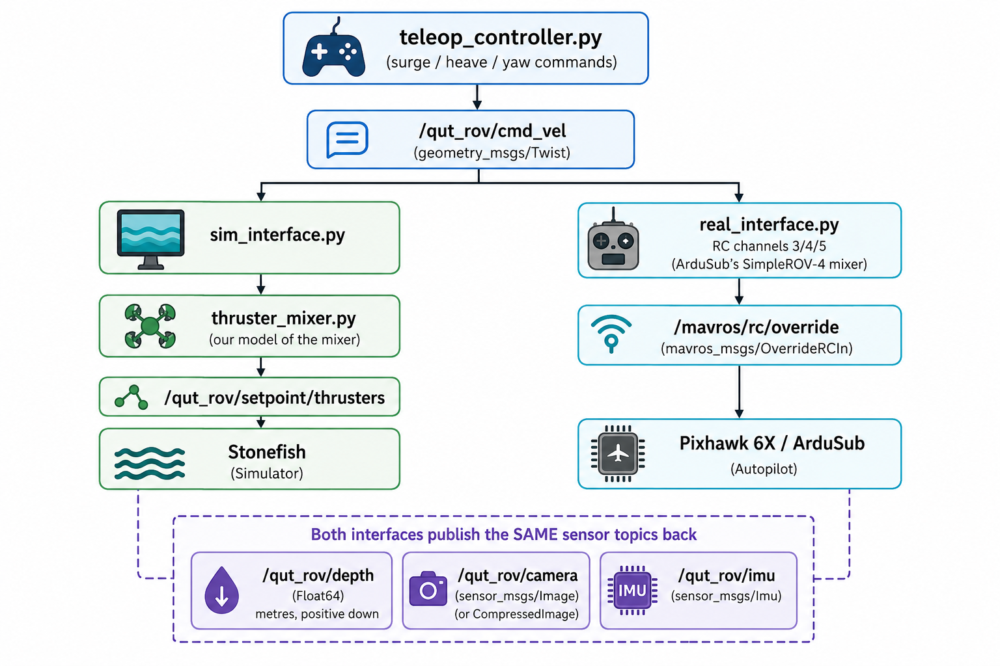
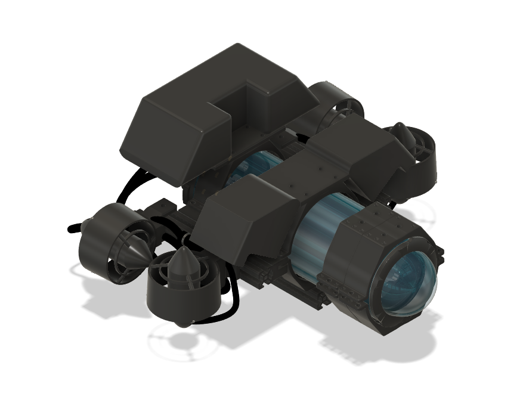
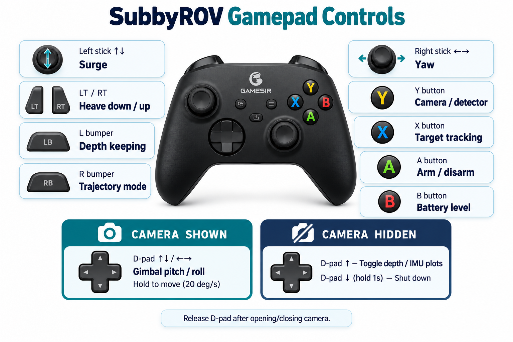

# SubbyROV — Digital Twin to Real Vehicle Control Stack

This ROS 2 control stack for the QUT SubbyROV underwater vehicle was built so that
the **same controller code can drive both the Digital Twin (DT) and the real
ROV**, accelerating autonomy development.

This was made for the EGH490 Research Project at QUT.

## Physical-vehicle updates

The real backend includes the current Real_ROV pressure decoder, controller tuning,
depth/heading hold, and tennis-ball distance following. Simulation retains its
existing gains, depth-only hold, Stonefish allocation, and YOLO follower.

Real pressure comes from MAVLink SCALED_PRESSURE3 (143), system/component 1/1,
on `/uas1/mavlink_source`. Keep the sensor in air during startup calibration.
Real depth hold also captures heading with a 5-degree deadband; trajectory mode
uses separate depth damping. The differing real base gains are `REAL_DEPTH_KI`,
`REAL_DEPTH_KD`, and `REAL_YAW_KP` in `rov_config.py`; real multipliers remain in
`sim_to_real_scales.py`. Changing the twin's base gains does not replace these
explicit real overrides.

Real tennis-ball following uses yaw/heave PD control and a fixed-zoom distance
estimate. Defaults command 0.25 normalized forward effort above an estimated
0.2 m distance. Camera/ball calibration and physical operation still require
vehicle validation. `tennis_ball_debug.py` displays the camera and HSV mask;
`pressure_streams.py` exposes diagnostic pressure streams and requests their rates.
Both utilities are installed as ROS executables.

Run the source regression suite after sourcing ROS:

```bash
PYTHONDONTWRITEBYTECODE=1 ROS_DOMAIN_ID=213 ROS_LOCALHOST_ONLY=1 python3 -m pytest -q src/stonefish_qut_rov/tests
```

The imported suite retains four known failures from Real_ROV: three thermal
recovery expectations (75 C in tests versus 79.5 C in runtime), and one gimbal
pitch-sign expectation. These disagreements were not changed during the merge.

## Architecture

The high-level controller publishes vehicle-level commands on
`/qut_rov/cmd_vel`, while the interfaces expose shared depth and IMU topics
(`/qut_rov/depth` and `/qut_rov/imu`). These commands are normalized
surge/heave/yaw efforts, not velocities in metres per second. The main teleop
controller uses the same control abstraction for simulation and the real vehicle.
Simulation images use `/qut_rov/camera`; the physical camera viewer reads RTSP
directly.

<p align="center">
  
</p>

### Digital Twin and real vehicle side by side

<p align="center">
  
  
</p>

### Digital Twin functions

The demonstration below shows the Digital Twin performing these functions
within a simulated 3D coral reef environment:

- Teleoperation
- Station keeping
- Trajectory setting
- Fish detection and tracking

https://github.com/user-attachments/assets/ffbe256a-3c4d-401d-acdf-2d69c06081ee


### DT and Real ROV Controls

The controls are illustrated in the following figure:
<p align="center">
  

### Nodes

The active Python code is in `src/stonefish_qut_rov/ros_nodes/`:

- `common/`: shared launchers, teleop, plotting, configuration, and helpers.
- `real/`: MAVROS interface, PWM monitoring, RTSP camera, gimbal, and ball tracking.
- `sim/`: Stonefish interface and fish detection/following.

`common/vehicle_command.py` defines the `VehicleCommand` type used by both
interfaces. Thruster allocation lives in `sim/thruster_mixer.py`; battery reporting
and physical-camera thermal safety live in `real/battery_status.py` and
`real/camera_thermal.py`. The shared teleop controller imports these real-mode
helpers for hardware operation. Shared configuration, including
`sim_to_real_scales.py`, remains in `common/`.

The build installs the nodes and helpers together, preserving existing
`ros2 run stonefish_qut_rov <node>.py` commands. After changing the source layout,
rebuild and source the workspace (also required for direct source execution):

```bash
colcon build --symlink-install --packages-select stonefish_qut_rov
source install/setup.bash
```

The GUI shell launcher is now `ros_nodes/common/launch_rov_gui.sh` within the
package.

| Node / module | Role |
| --- | --- |
| `rov_control.py` | Launcher: selects sim or real, starts the stack, and supervises shutdown |
| `rov_launcher_gui.py` | Optional GUI wrapper around the launcher |
| `teleop_controller.py` | Gamepad input, depth hold, and trajectory mode using shared control logic |
| `sim_interface.py` | Translates vehicle commands to Stonefish thruster setpoints |
| `real_interface.py` | Translates vehicle commands to MAVROS RC override; bridges pressure and IMU |
| `thruster_mixer.py` | Surge/heave/yaw to four-thruster allocation (**sim only**) |
| `pid_controller.py` | PID with derivative-on-measurement and integral clamping |
| `imu_depth_plotter.py` | Live depth and roll/pitch/yaw plots in both modes |
| `camera_viewer_rtsp.py` | Real-camera RTSP viewer, gimbal integration, and yellow-ball detection |
| `fish_detector_follower.py` | YOLO fish detection and visual servoing (**sim only**) |
| `rov_config.py` | Topics, gains, button mappings, and shared configuration |
| `sim_to_real_scales.py` | Real-vehicle scalers and hardware constants for sim-to-real pool trials |
| `control_utils.py` | Shared deadzone, clamping, and quaternion-to-RPY/yaw helpers |

### Thrust allocation is not shared

`thruster_mixer.py` runs in **simulation only**, translating surge, heave, and
yaw into four individual thruster commands. On the real vehicle, vehicle-level
commands go to ArduSub RC channels and the Pixhawk's configured mixer performs
the allocation. This project's expected SimpleROV-4 mapping is ch3 = heave,
ch4 = yaw, and ch5 = surge; verify the actual vehicle configuration before arming.

## Installation and running

### Physical ROV

Start with the **[physical ROV setup and troubleshooting guide](src/stonefish_qut_rov/README.md#physical-rov-copy-and-paste-setup)**.
It covers cloning, ROS Jazzy, tether networking, Pixhawk/MAVROS, camera video,
camera SSH keys, gimbal dependencies, daily startup and fault checks.

This repository is a ROS workspace: clone it as `ros2_ws`, not inside another
workspace's `src` directory. Simulation instructions and regression tests are
also in the [package README](src/stonefish_qut_rov/README.md).

### Digital Twin simulation

Simulation additionally needs a working Stonefish installation:

1. Install ROS 2 Jazzy on Ubuntu 24.04.
2. Build and install the [Stonefish library](https://github.com/patrykcieslak/stonefish).
3. Install/build a compatible [stonefish_ros2](https://github.com/patrykcieslak/stonefish_ros2)
   version and verify the simulator works independently.
4. Follow the [simulation build and run instructions](src/stonefish_qut_rov/README.md#simulation-build-and-run),
   including the additional detector dependencies if using fish following.

Physical-only operation does not require Stonefish. The physical guide includes
the correct workspace-level clone layout and a build that skips the simulator.
